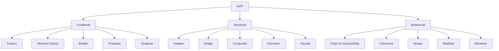

## 📓 To-Do List

| Creation Pattern      |  Structural Pattern   | Behavorial Pattern        |
|-----------------------|-----------------------|---------------------------|
| ✔️ Factory             | ✔️ Adapter             | ✔️ Chain of responsibility |
| ✔️ Abstract Factory    | ✔️ Bridge              | ✔️  Command                |
| ✔️ Builder             | ✔️ Composite           | :x: Iterator              |
| ✔️ Prototype           | ✔️ Decorator           | ✔️ Mediator                |
| ✔️ Singleton           | ✔️ Facade              | ✔️ Memento                 |
|                       | ✔️ Flyweight           | ✔️ Observer                | 
|                       | ✔️ Proxy               | ✔️ State                   |
|                       |                       | ✔️ Strategy                |
|                       |                       | ✔️ Template                | 
|                       |                       | :x: Visitor               |

## Types of Design Patterns

* Creational
* Structural
* Behavioral

|Creational       | Structural          | Behavioral              | 
|-----------------|---------------------|-------------------------|
| [Singleton](https://github.com/decipherDev/design-patterns/tree/master/src/main/java/dev/designpattern/singleton)       | [Proxy](https://github.com/decipherDev/design-patterns/tree/master/src/main/java/dev/designpattern/proxy)               | [Chain of responsibility](https://github.com/decipherDev/design-patterns/tree/master/src/main/java/dev/designpattern/chainofresponsibility) |
| [Builder](https://github.com/decipherDev/design-patterns/tree/master/src/main/java/dev/designpattern/builder)         |   [Adapter](https://github.com/decipherDev/design-patterns/tree/master/src/main/java/dev/designpattern/adapter)                  | [Command](https://github.com/decipherDev/design-patterns/tree/master/src/main/java/dev/designpattern/command)                 |
| [Prototype](https://github.com/decipherDev/design-patterns/tree/master/src/main/java/dev/designpattern/prototype) |[Decorator](https://github.com/decipherDev/design-patterns/tree/master/src/main/java/dev/designpattern/decorator) | [Memento](https://github.com/decipherDev/design-patterns/tree/master/src/main/java/dev/designpattern/memento) |
|[Factory](https://github.com/decipherDev/design-patterns/tree/master/src/main/java/dev/designpattern/factory) |[Flyweight](https://github.com/decipherDev/$design-patterns/tree/master/src/main/java/dev/designpattern/flyweight) | [Observer](https://github.com/decipherDev/design-patterns/tree/master/src/main/java/dev/designpattern/observer) |
| [Abstract Factrory](https://github.com/decipherDev/design-patterns/tree/master/src/main/java/dev/designpattern/abstractfactory)|[Bridge](https://github.com/decipherDev/design-patterns/tree/master/src/main/java/dev/designpattern/bridge) | [Template Method](https://github.com/decipherDev/design-patterns/tree/master/src/main/java/dev/designpattern/template) |
| |[Facade](https://github.com/decipherDev/design-patterns/tree/master/src/main/java/dev/designpattern/facade) | [State](https://github.com/decipherDev/design-patterns/tree/master/src/main/java/dev/designpattern/state) |
| | | [Mediator](https://github.com/decipherDev/design-patterns/tree/master/src/main/java/dev/designpattern/mediator) |
| | | [Strategy](https://github.com/decipherDev/design-patterns/tree/master/src/main/java/dev/designpattern/strategy) |
